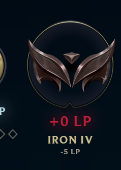
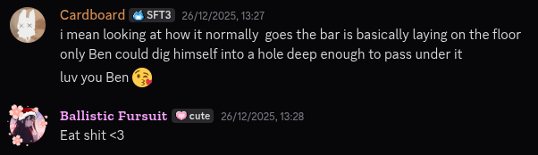

In my spare time, I enjoy playing League of Legends with friends. **However, if you have received this link before we play together for the first time,
then I must warn you**. My gameplay might not be quite up there with anything above.., let's say, *a piece of paper*.

As of writing this post, I am currently a little above level 70 if I recall correctly, so it is a little sad.

So.., what *can* you expect from me?
1. I try my best to win, I do what I can, even if teammates are screaming at me for inting the game.
2. I'm not toxic. I won't flame, grief or tilt in chat, I'd like to be a decent human being.
3. I will make mistakes, and I do my best to learn from them. Feel free to point them out to me!
4. I won’t rage quit, randomly go AFK, or give up after one bad fight.

## Rank?
You might be wondering just how low-ranked I actually am. Unfortunately, I don't have a good screenshot to proudly frame and hang on the wall.

What I *do* have are two badly taken screenshots at the end of my placement matches:

And no, your eyes are not deceiving you. I am, in fact, a low-ranked player who managed to get placed *below* the lowest rank.
That's right: **IRON IV, -5LP**.

A friend of mine once said that I’m the only person for whom the bar can be lying on the ground, and I’d still manage to dig a hole just to crawl under it.
And while he might have been talking about our D&D sessions, he is painfully correct.

With friends like these, who needs enemies?

Anyway, that's all I have to say for now. Thank you for reading, have a good one! 🩷
